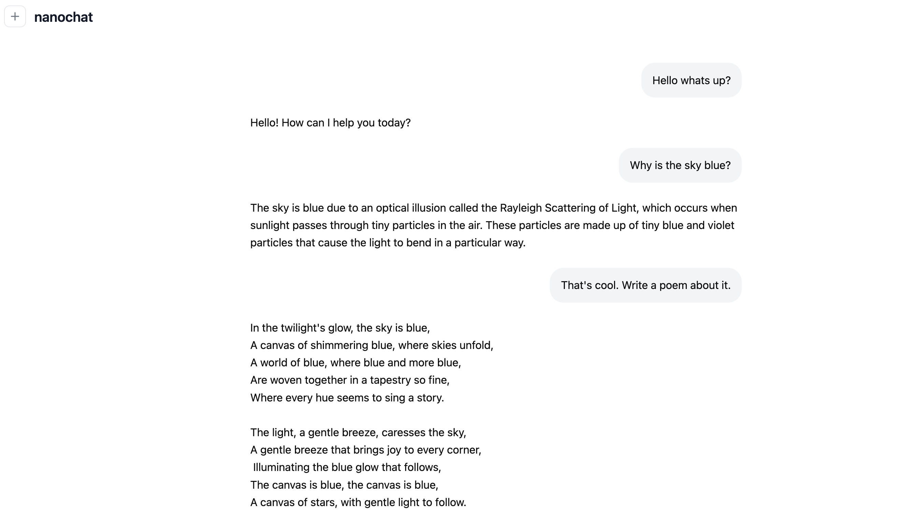

# nanochat (한국어 번역본)


> 100달러로 살 수 있는 최고의 ChatGPT.

이 저장소는 ChatGPT와 같은 LLM을 **단일 코드베이스** 안에서 완전하게 구현한 **풀스택 LLM 시스템**입니다.
`nanochat`은 단일 8×H100 노드에서 실행될 수 있도록 설계되었으며, [speedrun.sh](speedrun.sh) 같은 스크립트를 통해 전체 파이프라인을 자동으로 실행합니다.
이 파이프라인은 **토크나이징 → 사전학습 → 미세조정 → 평가 → 추론 → 웹 UI 서비스**까지 모두 포함합니다.
즉, 당신이 직접 학습시키고 대화할 수 있는 ChatGPT를 완성할 수 있습니다.
이 프로젝트는 Eureka Labs에서 개발 중인 **LLM101n** 강좌의 핵심 캡스톤 프로젝트가 될 예정입니다.

---

## 직접 대화해보기

현재 nanochat의 최종 결과물은 [nanochat.karpathy.ai](https://nanochat.karpathy.ai/)에서 [nanochat d32](https://github.com/karpathy/nanochat/discussions/8) 버전으로 체험할 수 있습니다.
여기서 “d32”는 Transformer 네트워크가 32개의 레이어로 구성되었음을 의미합니다.
이 모델은 **1.9억 개의 파라미터**를 가지고 있으며, **380억 개 토큰**으로 학습되었습니다.
단일 스크립트 [run1000.sh](run1000.sh)만 실행하면 완전히 동일한 과정을 거칠 수 있습니다.
전체 훈련 비용은 약 **800달러**이며, **8×H100 GPU 노드에서 약 33시간**이 소요됩니다.
이 모델은 2019년의 GPT-2보다 우수하지만, GPT-5와 같은 최신 LLM에는 아직 크게 미치지 못합니다.

이러한 “마이크로 모델(micro model)”들은 다소 실수를 많이 하고, 단순하거나 환각(hallucination)을 일으키기도 하지만,
**직접 통제하고, 수정하고, 실험할 수 있는 완전한 나만의 모델**이라는 점이 nanochat의 진정한 매력입니다.

---

## 빠른 시작 (Quick start)

가장 빠르게 체험하려면 [speedrun.sh](speedrun.sh) 스크립트를 실행하세요.
이 스크립트는 약 100달러 규모의 nanochat을 학습 및 추론까지 한 번에 수행합니다.
8×H100 노드(시간당 약 24달러 기준)에서 **약 4시간**이면 완료됩니다.

GPU 클라우드 제공업체(예: [Lambda](https://lambda.ai/service/gpu-cloud))에서 8×H100 노드를 실행한 후, 다음 명령어를 입력합니다:

```bash
bash speedrun.sh
```

4시간짜리 작업이므로, 보통 아래처럼 **screen 세션**을 열고 로그를 남기는 것을 추천합니다:

```bash
screen -L -Logfile speedrun.log -S speedrun bash speedrun.sh
```

screen 사용이 익숙하지 않다면 [screen 치트시트](https://gist.github.com/jctosta/af918e1618682638aa82)를 참고하세요.
실행 중엔 screen 세션 안에서 로그를 볼 수 있고, `Ctrl-a d`로 분리(detach)한 뒤 `tail speedrun.log`로 진행 상황을 모니터링할 수도 있습니다.

4시간 후 학습이 완료되면, ChatGPT 스타일의 **웹 UI**를 통해 직접 대화할 수 있습니다.
(가상환경 활성화 필요 — `source .venv/bin/activate`)
다음 명령어로 서버를 띄웁니다:

```bash
python -m scripts.chat_web
```

출력된 URL로 접속하세요.
예를 들어 Lambda에서는 퍼블릭 IP와 포트를 이용해 접속할 수 있습니다:
[http://209.20.xxx.xxx:8000/](http://209.20.xxx.xxx:8000/)

이제 당신만의 LLM과 자유롭게 대화해 보세요 —
이야기를 지어보거나, 시를 써보거나, “나는 누구야?”라고 물어보면 재밌는 환각을 경험할 수도 있습니다.
이 모델은 약 **4e19 FLOPs 수준**의 연산 능력을 갖춘, “유치원생과의 대화” 같은 느낌의 LLM입니다.

---



---

학습이 끝난 후에는 프로젝트 디렉터리에 자동 생성된 `report.md` 파일을 열어보세요.
이 파일은 학습 평가 지표와 요약 표를 포함한 **결과 리포트**입니다.

예시:

---

- Characters: 333,989
- Lines: 8,304
- Files: 44
- Tokens (approx): 83,497
- Dependencies (uv.lock lines): 2,004

| Metric        | BASE   | MID    | SFT    | RL     |
| ------------- | ------ | ------ | ------ | ------ |
| CORE          | 0.2219 | -      | -      | -      |
| ARC-Challenge | -      | 0.2875 | 0.2807 | -      |
| ARC-Easy      | -      | 0.3561 | 0.3876 | -      |
| GSM8K         | -      | 0.0250 | 0.0455 | 0.0758 |
| HumanEval     | -      | 0.0671 | 0.0854 | -      |
| MMLU          | -      | 0.3111 | 0.3151 | -      |
| ChatCORE      | -      | 0.0730 | 0.0884 | -      |

총 소요 시간: **3시간 51분**

---

(기본 실행 시 RL 지표는 포함되지 않을 수도 있습니다.)
speedrun 스크립트의 세부 과정과 기대 결과에 대한 자세한 설명은 다음 게시글을 참고하세요:
[Introducing nanochat: The best ChatGPT that $100 can buy](https://github.com/karpathy/nanochat/discussions/1)

---

## 더 큰 모델 (Bigger models)

당연히, 100달러 예산으로는 고성능 ChatGPT급 모델을 학습시키기 어렵습니다.
실제 LLM은 수백만 달러의 비용이 들어가는 경우가 많습니다.

이 프로젝트에서는 두 가지 상위 규모 모델이 추가로 연구 중입니다:

1. **약 300달러 규모 (d26)** — 12시간 학습, GPT-2 CORE 스코어를 약간 초과
2. **약 1000달러 규모 (~41.6시간)** — 깔끔한 단위로 설정된 상위 모델

이들은 아직 master 브랜치에는 병합되지 않았지만,
예시로 GPT-2급 d26 모델을 학습하려면 [speedrun.sh](speedrun.sh) 파일을 아래처럼 약간만 수정하면 됩니다:

```bash
...
# 더 많은 데이터 샤드를 다운로드해야 합니다.
# 파라미터 수 * 20 = 토큰 수, *4.8 = 문자 수, /250M = 필요한 샤드 수
python -m nanochat.dataset -n 450 &
...
# 모델 깊이를 늘리고, OOM 방지를 위해 배치 크기를 절반으로 줄이세요.
torchrun --standalone --nproc_per_node=8 -m scripts.base_train -- --depth=26 --device_batch_size=16
...
# midtraining에서도 동일하게 설정
torchrun --standalone --nproc_per_node=8 -m scripts.mid_train -- --device_batch_size=16
```

핵심은 **충분한 학습 데이터 확보**와 **VRAM 관리**입니다.
OOM이 날 경우 `--device_batch_size`를 32 → 16 → 8 → 4 → 2 → 1 순으로 줄이면 됩니다.
배치 크기가 줄면 스크립트가 자동으로 gradient accumulation을 늘려 **병렬 연산을 순차 연산으로 보정**합니다.

---

### 실행 환경 참고

- Ampere 8×A100 노드에서도 정상 작동하지만 속도는 다소 느림
- 단일 GPU에서도 `torchrun` 생략 시 자동 단일 모드로 동작하며 결과 동일 (다만 시간 8배 증가)
- VRAM이 80GB 미만인 경우 `--device_batch_size`를 반드시 조정해야 함
- 대부분의 코드는 **표준 PyTorch** 기반이므로 xpu, mps 등에서도 실행 가능하나 추가 설정 필요

---

## CPU / MPS에서 실행하기

MacBook이나 CPU 환경에서도 실험하고 싶다면 [CPU|MPS PR](https://github.com/karpathy/nanochat/pull/88)을 참고하세요.
Mac에서는 `base_train.py` 실행 시 `--device_type=mps` 옵션을 사용합니다.
물론 GPU 없이 학습 속도는 매우 느리지만, **코드를 이해하고 실험용 미니 모델을 훈련**하기에는 충분합니다.

---

## 질문하기

nanochat의 가장 큰 장점 중 하나는 **코드 전체가 짧고 단순하다**는 점입니다.
덕분에 파일 전체를 복사하여 LLM에게 직접 질문하기도 쉽습니다.
예를 들어 [files-to-prompt](https://github.com/simonw/files-to-prompt) 유틸리티로 다음 명령을 실행합니다:

```bash
files-to-prompt . -e py -e md -e rs -e html -e toml -e sh --ignore "*target*" --cxml > packaged.txt
```

이 명령은 `.py`, `.rs`, `.html`, `.toml`, `.sh` 파일을 모두 포함하고, `rustbpe/target` 폴더는 제외합니다.
출력된 `packaged.txt` 파일은 약 **330KB(= 약 10만 토큰 미만)**, **약 8천 줄, 45개 파일**입니다.

또는 [DeepWiki](https://deepwiki.com/)를 사용해도 됩니다.
GitHub URL에서 `github.com`을 `deepwiki.com`으로 바꾸기만 하면 됩니다.

---

## 테스트

현재 테스트는 많지 않지만, 특히 **토크나이저 관련 테스트**가 포함되어 있습니다.
다음과 같이 실행할 수 있습니다:

```bash
python -m pytest tests/test_rustbpe.py -v -s
```

---

## 기여하기

nanochat은 아직 완성된 프로젝트가 아닙니다.
목표는 **$1000 미만의 예산으로 접근 가능한 마이크로 LLM의 새로운 표준**을 만드는 것입니다.

접근성은 단순히 비용뿐만 아니라 **인지 복잡도(cognitive complexity)** 측면에서도 중요합니다.
따라서 nanochat은 방대한 설정 옵션, 거대한 모델 팩토리, if-else 괴물 같은 구조를 배제하고,
**단일하고 읽기 쉽고 해킹 가능한 "강력한 베이스라인" 코드베이스**로 남을 것입니다.

---

## 감사의 말 (Acknowledgements)

- 이름(nanochat)은 이전 프로젝트 [nanoGPT](https://github.com/karpathy/nanoGPT)에서 유래했습니다.
- [modded-nanoGPT](https://github.com/KellerJordan/modded-nanogpt)에서 영감을 받았으며, 리더보드/메트릭 구조 일부를 차용했습니다.
- 데이터 제공에 도움을 준 [HuggingFace](https://huggingface.co/)의 **fineweb**과 **smoltalk**에 감사드립니다.
- GPU 리소스를 지원해 준 [Lambda](https://lambda.ai/service/gpu-cloud)에 감사드립니다.
- 그리고 LLM 마스터 🧙‍♂️ **Alec Radford**에게 조언과 가이던스를 감사드립니다.

---

## 인용 (Cite)

연구나 프로젝트에서 nanochat을 활용했다면 다음과 같이 인용해주세요:

```bibtex
@misc{nanochat,
  author = {Andrej Karpathy},
  title = {nanochat: The best ChatGPT that $100 can buy},
  year = {2025},
  publisher = {GitHub},
  url = {https://github.com/karpathy/nanochat}
}
```

---

## 라이선스

MIT
